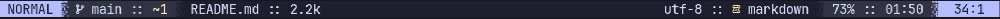

### Hey, I'm Ayush

A **backend engineer** passionate about building **scalable systems**,  
crafting **smooth developer workflows**, writing **scripts that automate life**,  
and contributing to **open source**.

- Exploring the depths of **Backend Development**
- Actively contributing to **FOSS projects**
- Obsessively customizing my [dotfiles](https://github.com/ad1822/hyprdots) and [scripts](https://github.com/ad1822/dotsh)
- Using [Neovim](https://github.com/ad1822/nvim.conf), Pressing some keybindings. Can't quit thought

```bash
ad@arch / ~>
───────────────────────────────────────────────
OS        : Linux 6.16.7-arch1-1
Editor    : Neovim v0.11.4
Languages : C++, TypeScript, Go
───────────────────────────────────────────────
Backend   : Node.js, Gin
Database  : PostgreSQL, MongoDB
───────────────────────────────────────────────
Workflow  : Shell Scripting, Automation, Tooling
Contact   : ayushdumasia604@gmail.com
───────────────────────────────────────────────
```

# Dev workflow tools

<p align="center">
  <a href="https://skillicons.dev">
    
  </a>
</p>




<!-- <p align="center">
  <a href="https://github.com/anuraghazra/github-readme-stats?tab=readme-ov-file#github-stats-card">
    
  </a>
  <a href="https://git.io/streak-stats">
    
  </a>
</p> -->
