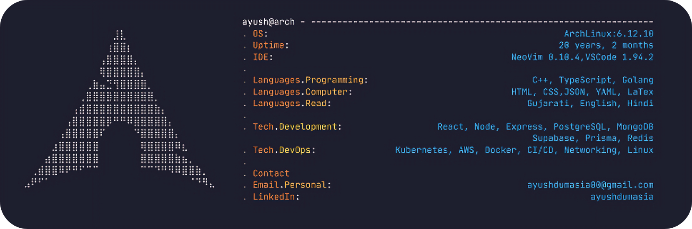

#### Hey, I'm Ayush 👋

A **backend** engineer passionate about building **scalable systems**, **designing resilient** **infrastructure**,**CI/CD** ,**automating everything** that moves and contributing to **open source**.

- ⚙️ Currently exploring the depths of **System Design**
- 🔨 Actively contributing to **FOSS projects**
- 🐧 Obsessed with customizing my [dotfiles](https://github.com/ad1822/hyprdots) & [scripts](https://github.com/ad1822/dotsh)


<!--  -->
<!-- ```
⠀⠀⠀⠀⠀⠀⠀⠀⠀⠀⠀⠀⠀⣸⣇⠀⠀⠀⠀⠀⠀⠀⠀⠀⠀⠀⠀⠀      OS:           Arch Linux x86_64
⠀⠀⠀⠀⠀⠀⠀⠀⠀⠀⠀⠀⢰⣿⣿⡆⠀⠀⠀⠀⠀⠀⠀⠀⠀⠀⠀⠀      Editor:       Neovim (LazyVim)
⠀⠀⠀⠀⠀⠀⠀⠀⠀⠀⠀⢠⣿⣿⣿⣿⡄⠀⠀⠀⠀⠀⠀⠀⠀⠀⠀⠀      Languages:    C++, TypeScript, Golang
⠀⠀⠀⠀⠀⠀⠀⠀⠀⠀⠀⢿⣿⣿⣿⣿⣿⡄⠀⠀⠀⠀⠀⠀⠀⠀⠀⠀
⠀⠀⠀⠀⠀⠀⠀⠀⠀⢀⣷⣤⣙⢻⣿⣿⣿⣿⡀⠀⠀⠀⠀⠀⠀⠀⠀⠀      ---------------------------------------------------
⠀⠀⠀⠀⠀⠀⠀⠀⢀⣿⣿⣿⣿⣿⣿⣿⣿⣿⣿⡀⠀⠀⠀⠀⠀⠀⠀⠀
⠀⠀⠀⠀⠀⠀⠀⢠⣾⣿⣿⣿⣿⣿⣿⣿⣿⣿⣿⣷⡄⠀⠀⠀⠀⠀⠀⠀      Development:  Node, Nest, Express, Postgres, MongoDB
⠀⠀⠀⠀⠀⠀⢠⣿⣿⣿⣿⣿⡿⠛⠛⠿⣿⣿⣿⣿⣿⡄⠀⠀⠀⠀⠀⠀      DevOps:       Kubernetes, AWS,Docker, CI/CD, Networking, Linux,Terraform
⠀⠀⠀⠀⠀⢠⣿⣿⣿⣿⣿⠏⠀⠀⠀⠀⠙⣿⣿⣿⣿⣿⡄⠀⠀⠀⠀⠀
⠀⠀⠀⠀⣰⣿⣿⣿⣿⣿⣿⠀⠀⠀⠀⠀⠀⢿⣿⣿⣿⣿⠿⣆⠀⠀⠀⠀      ---------------------------------------------------
⠀⠀⠀⣴⣿⣿⣿⣿⣿⣿⣿⠀⠀⠀⠀⠀⠀⣿⣿⣿⣿⣿⣷⣦⡀⠀⠀⠀
⠀⢀⣾⣿⣿⠿⠟⠛⠋⠉⠉⠀⠀⠀⠀⠀⠀⠉⠉⠙⠛⠻⠿⣿⣿⣷⡀⠀      Mail:         ayushdumasia00@gmai.com
⣠⠟⠋⠁⠀⠀⠀⠀⠀⠀⠀⠀⠀⠀⠀⠀⠀⠀⠀⠀⠀⠀⠀⠀⠈⠙⠻⣄

``` -->

┌────────────────────────────────────────────────────┐
│  OS:           Arch Linux x86_64                   │
│  Editor:       Neovim (LazyVim)                    │
│  Languages:    C++, TypeScript, Go                 │
├────────────────────────────────────────────────────┤
│  Development:  Node.js, NestJS, Express            │
│                PostgreSQL, MongoDB                 │
├────────────────────────────────────────────────────┤
│  DevOps:       Kubernetes, Docker, AWS             │
│                Terraform, CI/CD, Linux, Networking │
├────────────────────────────────────────────────────┤
│  Mail:         ayushdumasia604@gmail.com           │
└────────────────────────────────────────────────────┘

```

<div>
  <a href="https://github.com/anuraghazra/github-readme-stats?tab=readme-ov-file#github-stats-card"></a>
  <a href="https://github.com/anuraghazra/github-readme-stats?tab=readme-ov-file#top-languages-card"></a>
</div>
